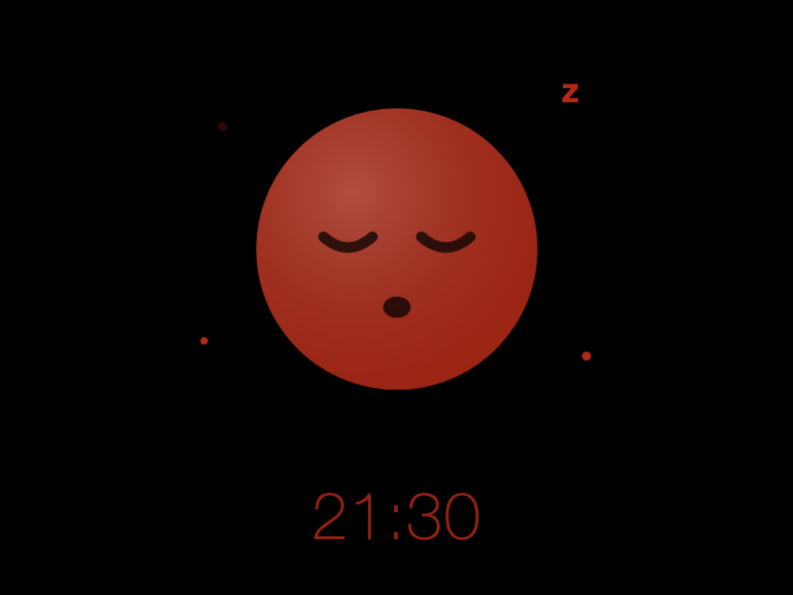
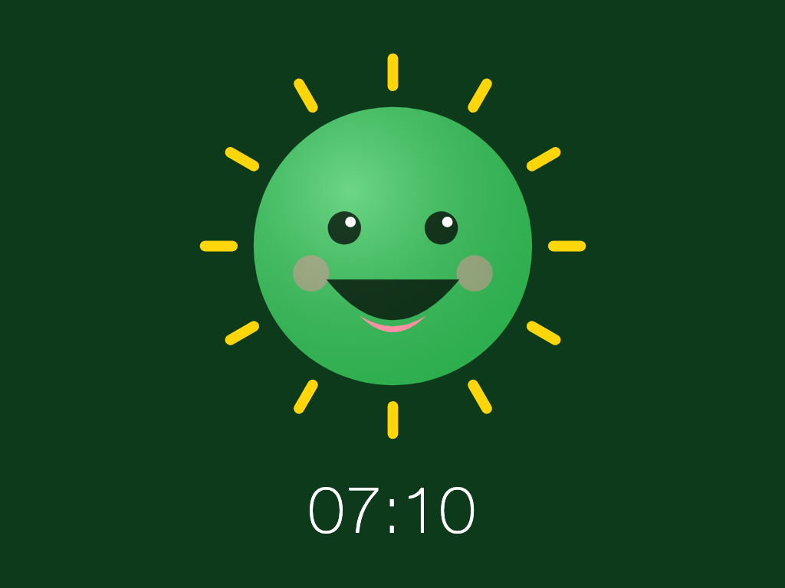
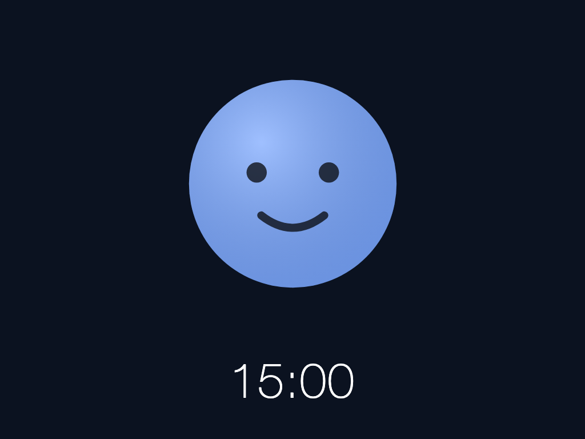
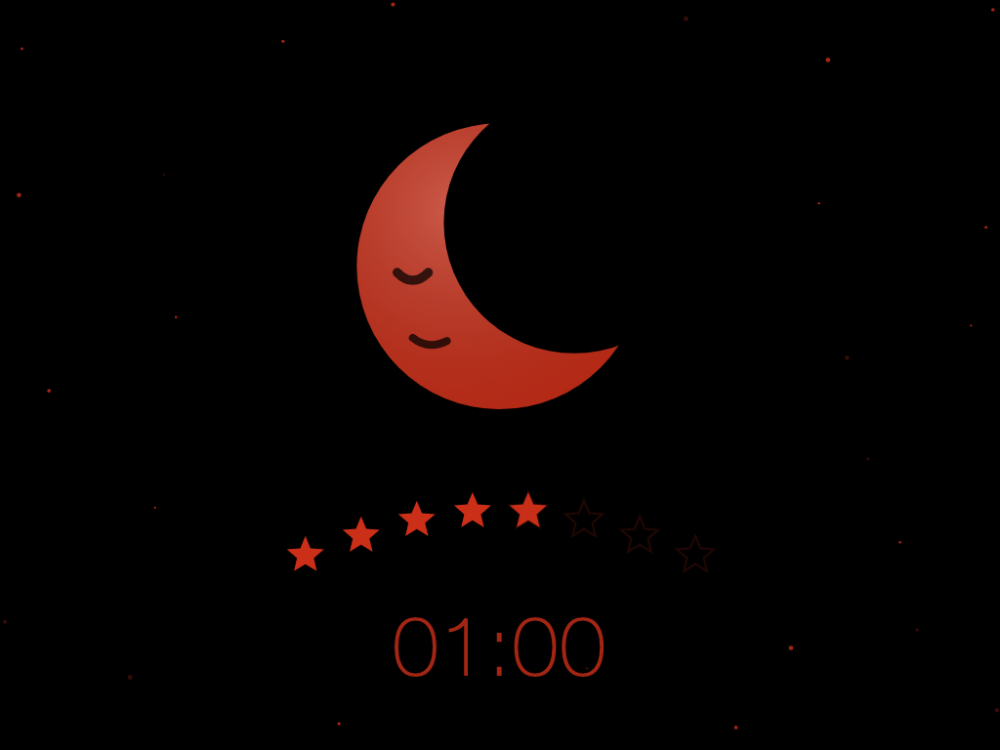
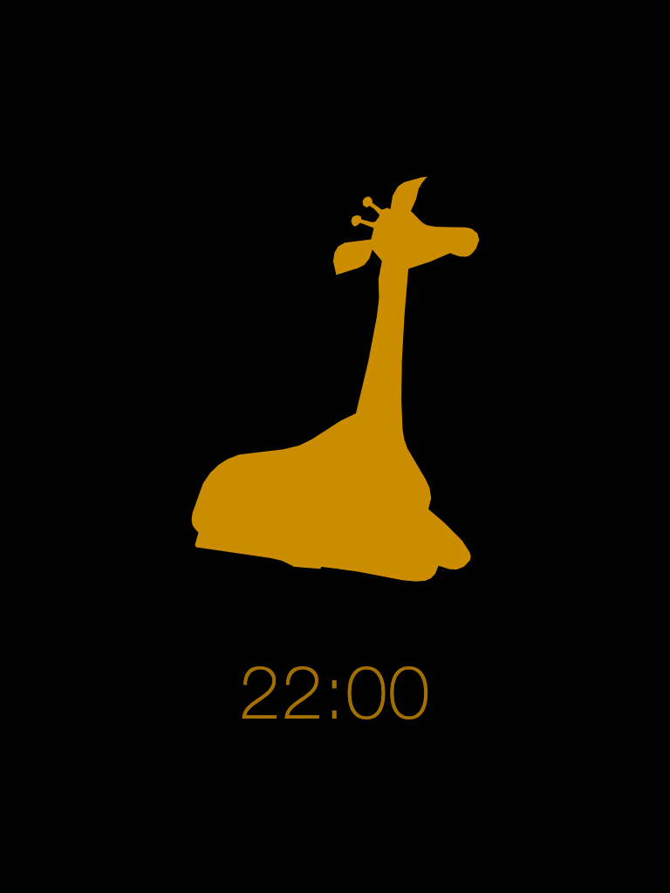
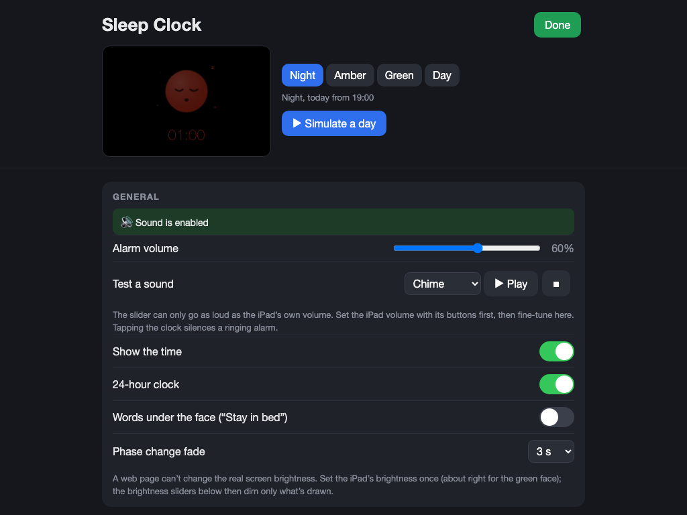
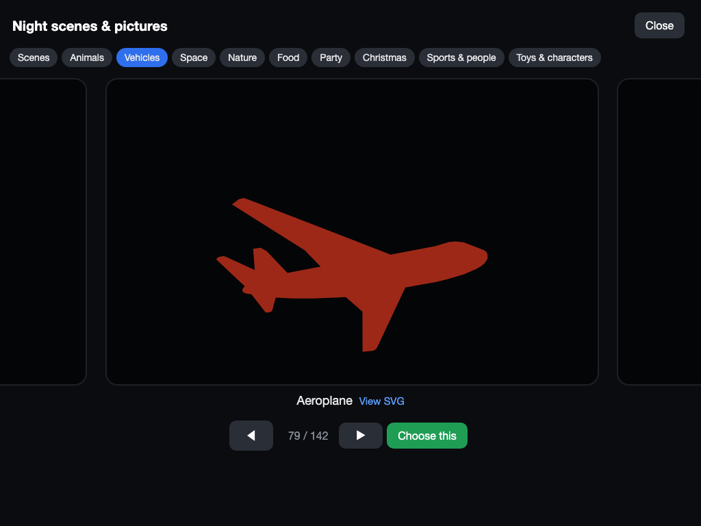

# Sleep Clock

**Turn an old tablet or phone into an "OK to wake" clock for a toddler.**

Young children can't read the time, so "stay in bed until 7" means nothing to them. A sleep-training clock shows it with colours instead:

- **red** means "it's still night, stay in bed";
- **green** means "it's morning, you can get up".

Sleep Clock does this on a device you already have. It runs as a single web page, added to the home screen and left on the wall or bedside table.

**It works completely offline.** After the first visit the clock keeps running with no internet at all:
- no account, no app store, no ads;
- nothing is ever sent anywhere;
- your schedule and settings stay on the device.

| Night: stay in bed | Morning: OK to get up | Day |
|---|---|---|
|  |  |  |

It was built for an **iPad mini 2 on iOS 12** (Safari 12), a device that can't run modern apps anymore. It works on any tablet or phone with a web browser.

## What it does

- **A different schedule for each day of the week:** a wake time and a bedtime for each day, e.g. a later wake-up at weekends. Night runs from bedtime to the next morning's wake time, and green then stays on for a set time (1 hour by default).
- **Optional amber "almost time" phase** before wake-up, so the child learns that morning is coming.
- **Night animations:** calm scenes that are dimmed and drawn in the night colour. A scene can have **extras** on top.
  - Scenes: a sleeping face with z's and stars, a slowly breathing face, a moon in a starry sky, or a **Night picture**. There are 138 pictures: cartoon animals plus silhouettes of animals, vehicles, rockets, trees, fruit, balloons and more, in 9 categories. Each one breathes, floats, sways or rocks gently.
  - Extras: a **star countdown** that loses one star at a time through the night, so the child can see how long is left; fireflies; shooting stars.
- **Nap timer:** red now for 30 minutes to 2 hours, then green.
- **Gentle sounds:** an optional wake-up sound (chime, music box, birds or ding-dong), optional soft brown noise at night, one shared volume, and a fade-in. Tapping anywhere stops a ringing alarm.
- **Colours and brightness:** pick the night colour (red, orange, amber…) and the day colour, and dim each phase. Phase changes can fade smoothly. The clock can show the time in 24-hour or 12-hour format, or not at all.
- **Parent-only settings:** hold the **top-right corner for 2.5 seconds** to open them. You can add an optional 4-digit PIN (it keeps toddlers out, not adults).
- **Live preview and "Simulate a day":** see every setting take effect straight away, and watch a whole day and night play in 30–120 seconds.
- **Keeps the screen on:** it uses the browser's built-in way to keep the screen awake where there is one, and a tiny silent video on older devices. Settings also explain how to run it full screen.
- **Works offline** after the first visit. Settings stay on the device, and you can export and import them as a text code.

| Moon & sky with the star countdown | A Night picture (amber) |
|---|---|
|  |  |

| Settings with live preview | Choosing a scene or picture |
|---|---|
|  |  |

## How to use it

### 1. Open the clock

There are two ways to get it.

**A. Just use it (easiest)**
- On the tablet or phone, open **https://flevanti.github.io/toddler-sleep-train-clock/** in the browser. That's it.
- The first visit saves the clock on the device, and from then on it works offline.
- New versions arrive automatically the next time the device is online and the page reloads.

**B. Host it yourself**
- The whole clock is two files: **`index.html`** and **`sw.js`**. Copy them together into the same folder on any web host, then open that address on the device.
- The address must be **HTTPS**, because offline mode and the home-screen app need it. Any web host, Cloudflare Pages, Netlify or your own server will do.
- To try it on a computer, `python3 -m http.server 8000` in the folder and `http://localhost:8000` also work.
- The first time, check that the page loads without certificate warnings. Very old devices can have trouble with some HTTPS certificates.

### 2. Add it to the home screen

- **iPad or iPhone:** in Safari, tap **Share → Add to Home Screen**.
- **Android:** in Chrome, open the menu and tap **Add to Home screen** (or **Install app**).

From then on, always open the clock from that icon. The home-screen app and a normal browser tab keep **separate settings**.

### 3. Set up the device

These steps are for an iPad or iPhone. On Android, use the equivalent settings: keep the screen on while charging, and use screen pinning instead of Guided Access.

- **Settings → Display & Brightness → Auto-Lock: Never.** Turn Auto-Brightness off and set the brightness to about right for the green face. A web page can't change the real screen brightness, so night dimming only darkens what is drawn.
- **Settings → General → Use Side Switch To: Lock Rotation**, so the side switch can't mute the sound. Check that Control Centre isn't on mute.
- Set the volume with the iPad's buttons, then open the clock and **tap once**. iOS only allows sound after a tap, and it asks again after every reload.
- Turn on **Guided Access** (triple-click Home). Disable the volume and sleep/wake buttons there, but **leave Touch on**, so you can re-enable sound after a reload.
- Keep it plugged in, and check the battery for swelling now and then.

The same checklist is at the bottom of the settings page.

### 4. Set the schedule

Hold the **top-right corner for 2.5 seconds** to open settings. Then set:
- the weekly schedule (wake time, bedtime and wake sound for each day);
- the colours and brightness;
- the night scene and extras.

Use the preview tabs (Night / Amber / Green / Day) to check how each phase looks, or **Simulate a day** to watch a whole day and night play through quickly.

## Feedback and ideas

Use GitHub Issues. A free GitHub account is needed.

- **[Suggest a feature](https://github.com/flevanti/toddler-sleep-train-clock/issues/new?template=feature_request.yml)**
- **[Report a problem](https://github.com/flevanti/toddler-sleep-train-clock/issues/new?template=bug_report.yml)**

The same links are at the bottom of the clock's settings page (**About & feedback**). From there, the clock version and the device are filled in for you.

## License

The code and the project's own drawings are released under the **[MIT License](LICENSE)**. That covers the cartoon animals, the scenes and the hand-drawn Dev's Favourite pictures.

**Third-party artwork isn't covered by this licence.** That means the downloaded silhouettes imported from `artwork/` and the pictures traced from files in `artwork/sources/`, including the Canottieri Firenze symbol. They belong to their authors, under their own terms. If you reuse the project, check or replace them.

The tiny silent video used to keep older screens awake comes from [NoSleep.js](https://github.com/richtr/NoSleep.js) (MIT, Rich Tibbett).

## Project layout

| Path | What it is |
|---|---|
| `index.html` | The whole app: page, styles, script, and all drawings (Night pictures are plain SVG `<template>`s in one marked section). |
| `sw.js` | Offline cache (a service worker): tries the network first and falls back to the cached copy. |
| `REQUIREMENTS.md` | What the clock must do and why: design decisions, Safari 12 limits, behaviour details. |
| `tests/` | Browser tests (Python + Playwright, headless Chromium with a faked clock) and a Safari 12 syntax/feature check. See [`tests/README.md`](tests/README.md). |
| `artwork/`, `tools/import_artwork.py` | Source SVGs for the Night pictures and the importer that turns them into small templates in `index.html`. See [`artwork/README.md`](artwork/README.md). |
| `tools/readme_screenshots.py` | Regenerates the screenshots in `docs/screenshots/`. |
| `.github/ISSUE_TEMPLATE/` | The "Suggest a feature" and "Report a problem" forms on GitHub. |
| `docs/superpowers/` | Design spec and implementation plan for the night animations. |

Neither `artwork/`, `tools/`, `tests/` nor `docs/` is needed to run the clock.

## Development

The clock is plain ES2017 JavaScript, CSS and SVG, with no build step and no dependencies, so that it runs on Safari 12. Before changing anything, read the limits listed in `REQUIREMENTS.md` §1.

**Setup (once):**

```sh
python3 -m venv .venv
.venv/bin/pip install -r tests/requirements.txt
.venv/bin/playwright install chromium
```

**Run the tests:**

```sh
tests/check_static.sh    # syntax + forbidden-feature check for Safari 12
tests/run_all.sh         # all browser test suites
```

**Try it locally:** run `python3 -m http.server 8000` in the repo folder and open `http://localhost:8000`.

**Add Night pictures:**
1. Drop SVGs in `artwork/incoming/`.
2. Add a line for each to `artwork/CATALOG.md`.
3. Run `python3 tools/import_artwork.py`.
4. Run the tests.

Headless Chromium isn't Safari 12, so always give changes a final check on the real iPad.
